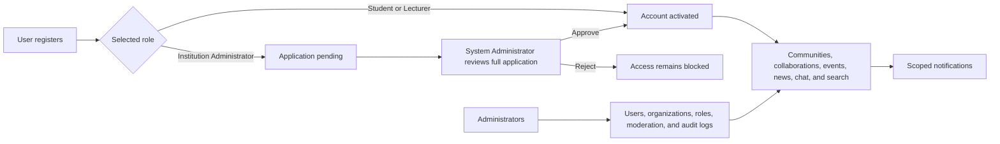

# Academic Collaboration and Notification System

A full-stack collaboration platform for universities, research institutions, students, lecturers, and administrators. The system brings academic communities, collaboration projects, events, institutional news, real-time messaging, notifications, search, and administration into one controlled workspace.

This README is the product, deployment, operations, and handover guide for the current release.

## Contents

- [Product overview](#product-overview)
- [How the system works](#how-the-system-works)
- [Users, roles, and permissions](#users-roles-and-permissions)
- [Access and audience rules](#access-and-audience-rules)
- [Administration workspace](#administration-workspace)
- [Technology stack](#technology-stack)
- [Architecture](#architecture)
- [System requirements](#system-requirements)
- [Local installation](#local-installation)
- [Environment configuration](#environment-configuration)
- [Production deployment](#production-deployment)
- [Production security checklist](#production-security-checklist)
- [Backup and recovery](#backup-and-recovery)
- [Upgrade procedure](#upgrade-procedure)
- [Acceptance checklist](#acceptance-checklist)
- [Handover package](#handover-package)
- [Troubleshooting](#troubleshooting)

## Product overview

The platform is designed for organizations that need one place to coordinate academic work while keeping administrative authority and institution boundaries clear.

Core capabilities include:

- Account registration, authentication, approval, suspension, and profile management
- Institution and department directories
- Public, private, and institution-only academic communities
- Community invitations, membership, posts, comments, and likes
- Collaboration projects with requirements, join requests, member roles, and protected files
- Public and institution-only academic events with capacity-controlled registration
- System-wide and institution-owned news with images and supporting documents
- Direct and group chat using Socket.IO
- Persistent and real-time notifications with deep links
- Global search across users and academic content
- System-wide and institution-scoped administrative workspaces
- Administrative audit logging
- Custom role labels that inherit established permission levels

## How the system works



### 1. Registration and identity

Users register as a Student, Lecturer, or Institution Administrator. System Administrator registration is not public.

- Students provide a Student ID containing letters, numbers, slashes, or hyphens, up to 30 characters.
- Lecturers select an institution and department and provide professional details.
- Institution Administrators select an institution and provide professional details.
- Passwords must contain at least eight characters.
- Email addresses are unique.

Required professional details are staff ID, job title, qualification, expertise or administrative area, and a valid phone number.

### 2. Institution Administrator approval

An Institution Administrator registration is created with a `pending` approval status. The applicant receives a success card explaining that access must wait for System Administrator approval.

The System Administrator is notified and must open the application review card before making a decision. The card contains the applicant's identity, institution, department, staff information, qualification, contact details, expertise, biography, submission date, and review status.

- Approval activates the account for sign-in.
- Rejection keeps the account blocked and records the review notes.
- Incomplete professional information cannot be approved.
- The applicant receives a notification after the decision.

### 3. Authentication and account state

The API issues a JSON Web Token after a successful login. Every protected API request checks both the token and the current database record, so role, affiliation, suspension, and approval changes take effect even when an older token still exists.

An account has two independent controls:

| Control | Values | Effect |
| --- | --- | --- |
| Account status | `active`, `suspended` | Suspended accounts cannot use protected application features. |
| Approval status | `pending`, `approved`, `rejected` | Only approved accounts can use protected application features. |

### 4. Academic activity

After login, approved users can create and join academic spaces, collaborate on projects, register for eligible events, read news, communicate, receive notifications, maintain a profile, and search the platform.

Content ownership remains important:

- Community owners manage the community and its membership.
- Community members can participate in posts, comments, and likes.
- Collaboration owners review join requests and manage members and files.
- Event organizers manage their events and see attendee information.
- News management follows administrator scope.
- System Administrators have global moderation capabilities.

### 5. Notifications

Notifications are stored in PostgreSQL and delivered in real time when the recipient is connected.

- A public community notifies every other active, approved user.
- An institution-only community notifies active, approved users in that institution.
- A collaboration available to everyone notifies every other active, approved user.
- An institution-only collaboration notifies active, approved users in that institution.
- Private communities do not send a platform-wide announcement.
- Join requests, approval decisions, event activity, group-chat additions, and chat messages generate targeted notifications.

## Users, roles, and permissions

The application has four base permission levels. Custom roles provide organization-specific names and colors but must inherit one of the existing base levels.

### Permission matrix

| Capability | Student | Lecturer | Institution Administrator | System Administrator |
| --- | :---: | :---: | :---: | :---: |
| Use dashboard, profile, search, and notifications | Yes | Yes | Yes | Yes |
| Create and join communities | Yes | Yes | Yes | Yes |
| Create collaboration projects and request membership | Yes | Yes | Yes | Yes |
| Use direct and group chat | Yes | Yes | Yes | Yes |
| View eligible events and register | Yes | Yes | Yes | Yes |
| Create events | No | No | Yes | Yes |
| Publish news | No | No | Own institution | System-wide |
| Open the administration workspace | No | No | Own institution | System-wide |
| Manage Student and Lecturer accounts | No | No | Own institution | System-wide |
| Suspend or reactivate eligible users | No | No | Own institution, excluding administrators | System-wide, excluding System Administrator accounts |
| Assign Student or Lecturer access | No | No | Own institution | System-wide |
| Assign administrator access | No | No | No | Yes |
| Approve Institution Administrator applications | No | No | No | Yes |
| Change a user's institution or department | No | No | No | Yes |
| Manage institutions | No | No | View own institution | Yes |
| Manage departments | No | No | Own institution | System-wide |
| Manage custom roles | No | No | Own institution | System-wide |
| Moderate communities and events | No | No | Institution-owned content | System-wide |
| View administrative audit logs | No | No | Institution-scoped activity | System-wide activity |

### Student

Students are standard academic participants. They can use collaboration features, create content available to their audience, register for events, communicate, and maintain a profile. A valid Student ID is required.

Students cannot access administrative functions, create events, or publish news.

### Lecturer

Lecturers have the same base collaboration access as Students but use a professional academic profile. An institution, department, and complete professional details are required.

The Lecturer base role does not automatically grant administrative access or publishing rights.

### Institution Administrator

Institution Administrators combine normal collaboration access with administrative authority limited to their own institution. Scope is enforced by backend queries and mutations, not only by hidden interface controls.

They can:

- View institution-level statistics
- Create and manage Student and Lecturer accounts for their institution
- Suspend or reactivate eligible non-administrator users in their institution
- Manage their institution's departments
- Create custom roles that inherit Student or Lecturer access
- Create and manage institution-owned events and news
- Moderate institution-owned communities and events
- Review institution-scoped audit history

They cannot:

- Approve or reject Institution Administrator applications
- Manage System Administrator or Institution Administrator accounts
- Assign administrator roles
- Move users between institutions or departments
- Manage other institutions
- Access system-wide audit activity

### System Administrator

The System Administrator is the platform owner role. It has system-wide visibility and authority, including:

- Reviewing Institution Administrator applications
- Managing users, affiliations, statuses, and role assignments
- Creating and maintaining institutions and departments
- Managing the global role catalogue and institution-specific custom roles
- Publishing and managing system-wide news and events
- Moderating communities and events across the platform
- Viewing system-wide statistics and audit logs

The application intentionally provides account suspension and editing instead of general user deletion from the administration workspace.

### Custom roles

Administrators can create custom role labels for organizational needs, such as Teaching Assistant or Research Coordinator.

- A custom role inherits either Student or Lecturer permissions.
- Institution Administrators can create and manage custom roles only for their institution.
- Custom roles do not create new backend permission levels.
- System roles cannot be removed as ordinary custom roles.

## Access and audience rules

### Communities

| Community type | Discoverability and membership | Announcement audience |
| --- | --- | --- |
| Public | Available across the platform | All other active, approved users |
| Institution | Limited to users belonging to the hosting institution | Other active, approved users in that institution |
| Private | Controlled through invitations | No mass announcement |

The creator joins automatically. Community posts and comments require membership, ownership, or authorized moderation access. Comment deletion is reserved for the community owner. Post deletion follows post ownership, community ownership, or System Administrator moderation.

### Collaboration projects

Projects are private workspaces with one of two request audiences:

- `everyone`: all approved users may discover the project and request to join.
- `institution`: only users from the owner's institution may request to join.

The owner becomes the project lead, reviews requests, manages membership, edits the project, and controls project files. Accepted users join as contributors. Project file access is protected through authenticated download routes.

### Events

Only Institution Administrators and System Administrators can create events. Events may be available across the platform or restricted to one institution.

- Eligible users may register or cancel their registration.
- Capacity is enforced before registration.
- The meeting link is shown only to the organizer, a registered attendee, or the System Administrator.
- Organizers and authorized administrators can manage events.

### News

Institution Administrators publish news owned by their institution. System Administrators publish system-wide news and can manage all news. News can include a feature image, an optional external link, and up to eight supporting documents.

Feature images are public assets within the application. Supporting documents use authenticated download routes.

### Chat

Approved users can create direct-message rooms and group rooms. Room membership controls message reading and sending. Messages are persisted in PostgreSQL, broadcast through Socket.IO, and generate notifications for other room members.

## Administration workspace

The administration workspace contains:

| Area | Purpose |
| --- | --- |
| Overview | User and content statistics for the administrator's scope |
| People | Create, inspect, edit, assign roles, suspend, reactivate, and review applicants |
| Organizations | Manage institutions and departments according to scope |
| Roles | View system roles and manage eligible custom roles |
| Moderation | Review and remove communities or events within scope |
| Activity | Review administrative audit records within scope |

Administrative changes such as user creation, profile changes, role assignments, account suspension, application reviews, directory changes, moderation, and role maintenance are recorded in the audit log.

## Technology stack

| Layer | Technology |
| --- | --- |
| Frontend | React 18, Vite 5, Tailwind CSS, Lucide React |
| Backend | Node.js, Express 4, Socket.IO 4 |
| Database | PostgreSQL with the `pg` driver |
| Authentication | JSON Web Tokens and bcrypt password hashing |
| File handling | Multer with local disk storage |
| Realtime | Socket.IO notifications and chat messages |

## Architecture

```text
Browser
  |-- React/Vite user interface
  |-- Bearer token API requests
  `-- Socket.IO connection
          |
          v
Node.js / Express API
  |-- Authentication and authorization middleware
  |-- Controllers and administrative audit service
  |-- Protected file download routes
  |-- Socket.IO notification and chat delivery
  |-- Local runtime upload storage
  `-- PostgreSQL connection pool
          |
          v
PostgreSQL database
  |-- Users, roles, institutions, and departments
  |-- Communities, posts, comments, and likes
  |-- Projects, memberships, requests, and file metadata
  |-- Events and registrations
  |-- News and document metadata
  |-- Chats and messages
  `-- Notifications and audit logs
```

## Repository structure

```text
.
|-- backend/
|   |-- src/
|   |   |-- config/        Database, Socket.IO, and server configuration
|   |   |-- controllers/   API behavior and permission enforcement
|   |   |-- middleware/    Authentication, authorization, and uploads
|   |   |-- models/        PostgreSQL schema and baseline data
|   |   |-- routes/        Express API routes
|   |   |-- services/      Notifications and administrative audit logging
|   |   `-- utils/         Shared input validation
|   `-- uploads/           Runtime uploads; excluded from Git
|-- frontend/
|   |-- public/            Static assets
|   `-- src/
|       |-- components/    Shared interface components
|       |-- context/       Authentication, sockets, and notifications
|       |-- layouts/       Navigation and page shells
|       |-- pages/         Product screens
|       `-- services/      API client
|-- design-system/         Visual design reference
|-- .gitignore
`-- README.md
```

## System requirements

- Node.js 18 or newer
- npm 9 or newer
- PostgreSQL 14 or newer
- A persistent filesystem or object-storage integration for uploads
- A reverse proxy with HTTPS and WebSocket support for production

## Local installation

### 1. Clone and enter the project

```powershell
git clone <repository-url>
cd Collaboration
```

### 2. Create PostgreSQL database

```sql
CREATE DATABASE collaboration_db;
```

The backend executes `backend/src/models/schema.sql` during startup. It creates missing tables, applies the included compatible schema updates, and seeds the baseline roles, sample institutions, and departments.

### 3. Configure the backend

```powershell
Set-Location backend
Copy-Item .env.example .env
npm ci
```

Edit `backend/.env`:

```dotenv
PORT=5000
DB_USER=postgres
DB_HOST=localhost
DB_PORT=5432
DB_PASSWORD=replace_with_database_password
DB_NAME=collaboration_db
JWT_SECRET=replace_with_a_long_random_secret
JWT_EXPIRES_IN=7d
```

Start the API:

```powershell
npm run dev
```

Confirm the health endpoint:

```powershell
Invoke-RestMethod http://127.0.0.1:5000/health
```

### 4. Configure the frontend

Open a second terminal:

```powershell
Set-Location frontend
npm ci
```

Create `frontend/.env.local` when the API does not use the default address:

```dotenv
VITE_API_URL=http://127.0.0.1:5000/api
```

Start the frontend:

```powershell
npm run dev
```

Open the URL printed by Vite, normally `http://localhost:5173`.

## Default System Administrator

On an empty database, startup creates one System Administrator if no account with the `admin` base role exists:

| Field | Development default |
| --- | --- |
| Email | `admin@collaboration.edu` |
| Password | `admin123` |

These credentials are for initial local setup only. Before production use, sign in, create the permanent System Administrator account with complete professional information, confirm access, and retire the seeded credential through a controlled database or application maintenance procedure.

Do not expose a deployment that still accepts the default password.

## Environment configuration

### Backend

| Variable | Required in production | Purpose |
| --- | :---: | --- |
| `PORT` | Yes | Preferred HTTP and Socket.IO port. The local server can fall back to later ports if occupied. Production process configuration should reserve a fixed port. |
| `DB_USER` | Yes | PostgreSQL user |
| `DB_HOST` | Yes | PostgreSQL host |
| `DB_PORT` | Yes | PostgreSQL port |
| `DB_PASSWORD` | Yes | PostgreSQL password |
| `DB_NAME` | Yes | PostgreSQL database |
| `JWT_SECRET` | Yes | Secret used to sign and verify access tokens |
| `JWT_EXPIRES_IN` | Recommended | Token lifetime, default `7d` |

### Frontend

| Variable | Required in production | Purpose |
| --- | :---: | --- |
| `VITE_API_URL` | Yes | Complete API base URL, including `/api`; embedded during `npm run build` |

The current Socket.IO client endpoint is defined in `frontend/src/context/SocketContext.jsx`. Set it to the deployed backend origin, or refactor it to a build-time environment variable, before creating a production build on a different host.

## Available commands

Run each command from the indicated directory.

| Directory | Command | Purpose |
| --- | --- | --- |
| `backend` | `npm ci` | Install the locked backend dependency set |
| `backend` | `npm run dev` | Start the API with Nodemon |
| `backend` | `npm start` | Start the API with Node.js |
| `frontend` | `npm ci` | Install the locked frontend dependency set |
| `frontend` | `npm run dev` | Start the Vite development server |
| `frontend` | `npm run build` | Create the production frontend bundle in `frontend/dist` |
| `frontend` | `npm run preview` | Preview the production bundle locally |

## Production deployment

### Recommended topology

Use three durable services:

1. A static host or web server for `frontend/dist`
2. One Node.js service for the Express API and Socket.IO
3. One managed or self-hosted PostgreSQL database with automated backups

A reverse proxy should:

- Terminate HTTPS
- Forward API requests to the Node.js service
- Support WebSocket upgrade requests for Socket.IO
- Apply appropriate request-size limits for uploads up to 15 MB per file
- Serve the single-page application fallback for frontend routes

### Build frontend

Set the production API URL before building:

```powershell
Set-Location frontend
$env:VITE_API_URL = "https://api.example.edu/api"
npm ci
npm run build
```

Deploy the contents of `frontend/dist` to the static host.

### Run backend

Set production environment variables in the hosting platform or secret manager, then run:

```powershell
Set-Location backend
npm ci --omit=dev
npm start
```

Use a service manager such as systemd, PM2, a container platform, or the hosting provider's managed process runtime. Configure automatic restarts and health monitoring against `/health`.

### Database deployment

- Create an empty production database and a least-privilege application user.
- Allow the application user to create and alter the application's tables during controlled deployment, because startup runs the schema script.
- Run the first startup during a maintenance window.
- Confirm that the baseline roles exist and that the intended System Administrator can sign in.
- Take a backup before every application upgrade.

### Upload persistence

Runtime files are stored below `backend/uploads/`:

- `avatars/`
- `news/images/`
- `news/documents/`
- `projects/`
- `research/`

This directory is excluded from Git and must be mounted on persistent storage. Back up the database and upload directory together so file metadata and physical files remain consistent.

For horizontal scaling or serverless deployment, replace local disk storage with durable object storage before running multiple API instances.

## Production security checklist

Complete every item before exposing the system to the public internet:

- Replace the development `JWT_SECRET` with a long, random secret stored outside source control.
- Remove or retire the seeded `admin@collaboration.edu` / `admin123` credential.
- Use a dedicated PostgreSQL account and a strong database password.
- Restrict PostgreSQL network access to the application service and approved operators.
- Serve the frontend, API, uploads, and Socket.IO connection over HTTPS.
- Replace permissive CORS settings in `backend/src/index.js` and `backend/src/config/socket.js` with the exact deployed frontend origin.
- Configure the production Socket.IO endpoint instead of the current localhost address.
- Add token-based Socket.IO authentication before treating realtime connections as a security boundary.
- Add reverse-proxy rate limiting and request-size limits.
- Keep `backend/.env`, database dumps, logs, and `backend/uploads/` outside public web roots and source control.
- Validate backup restoration, not only backup creation.
- Review application and reverse-proxy logs without recording passwords or bearer tokens.
- Apply supported Node.js, npm, PostgreSQL, and dependency security updates.

## Backup and recovery

### Database backup

```powershell
pg_dump --format=custom --file=collaboration_db.backup collaboration_db
```

### Database restore

```powershell
createdb collaboration_db_restored
pg_restore --dbname=collaboration_db_restored collaboration_db.backup
```

Also back up `backend/uploads/` at the same recovery point. Test restoration in a separate environment before relying on the backup procedure.

Recommended minimum operations policy:

- Daily database and upload backups
- Encrypted off-server backup storage
- Defined retention periods
- Monthly restore test
- Backup before every release
- Documented recovery owner and recovery-time objective

## Upgrade procedure

1. Announce a maintenance window if the release changes the database or uploads.
2. Back up PostgreSQL and `backend/uploads/`.
3. Pull or deploy the reviewed release.
4. Run `npm ci` in both application directories.
5. Set the production frontend environment and run `npm run build`.
6. Restart the backend service so the schema script runs.
7. Check `/health`, login, role scope, file access, Socket.IO, and notifications.
8. Keep the previous release artifact available until acceptance checks pass.

## Acceptance checklist

Use this list for deployment sign-off or buyer handover:

- [ ] Frontend production build completes successfully
- [ ] Backend starts against an empty database
- [ ] `/health` returns HTTP 200
- [ ] Permanent System Administrator can sign in
- [ ] Default administrator credential is retired
- [ ] Student and Lecturer registration and login work
- [ ] Institution Administrator registration shows the pending-success card
- [ ] System Administrator can inspect, approve, and reject applications
- [ ] Institution Administrator cannot access another institution's administrative data
- [ ] Public and institution notification audiences are correct
- [ ] Community membership and ownership permissions are correct
- [ ] Collaboration join requests and protected file downloads work
- [ ] Event capacity, audience, and meeting-link rules work
- [ ] News image and supporting-document workflows work
- [ ] Direct chat, group chat, and real-time delivery work
- [ ] Suspension blocks an existing account
- [ ] Audit records appear in the correct administrative scope
- [ ] HTTPS, CORS, Socket.IO, and reverse-proxy settings are production-specific
- [ ] Database and upload backup restoration has been tested

## Handover package

A complete sale or organizational handover should include:

- The reviewed source repository and release identifier
- Production frontend and backend environment-variable inventory without plaintext secrets
- Database host, owner, backup policy, and restoration procedure
- Upload-storage location and retention policy
- Domain, DNS, TLS certificate, reverse-proxy, and hosting ownership
- Permanent System Administrator ownership and recovery procedure
- Deployment and rollback instructions
- Dependency and infrastructure account ownership
- Known limitations and agreed post-handover support period
- Written intellectual-property and software-license terms

No license file is currently included in this repository. Ownership, resale, reuse, warranty, and support rights must therefore be defined in the sale or handover agreement before transferring the system.

## Operational notes and current limitations

- The frontend is a client-rendered single-page application; production hosting must redirect unknown frontend routes to `index.html`.
- The API and Socket.IO server run in the same Node.js process.
- The backend tries later ports when the preferred port is occupied. Production should reserve and monitor one fixed port.
- Database schema initialization runs automatically on backend startup. Production releases should still use backups and controlled deployment windows.
- Uploads use local disk storage and require persistent storage on the host.
- The Socket.IO browser endpoint is currently configured directly in source and must be changed for a non-local deployment.
- CORS currently accepts the requesting origin and must be restricted for production.
- There is no automated test command in the current package scripts; use the acceptance checklist and add automated integration coverage as the product evolves.
- General user deletion is intentionally absent from the administration workflow; use suspension and profile correction.

## Troubleshooting

### API returns an HTML page or an unexpected response

Confirm that `VITE_API_URL` includes `/api`, the intended backend process is running, and no older service is still occupying port 5000.

### Frontend cannot connect after the backend chooses another port

Update `VITE_API_URL` and the Socket.IO endpoint to the actual backend port. Restart or rebuild the frontend as appropriate.

### Database changes do not appear

Confirm the application is connected to the expected database, inspect the live schema, restart the backend to run `schema.sql`, and then retest the relevant API.

### Images work but documents do not

Avatars and news feature images are served as static application assets. Project files and news supporting documents use authenticated download routes and require a valid token.

### Institution Administrator sees incomplete data

Confirm the administrator and target records have the correct `institution_id`. Institution-scoped API queries deliberately exclude other institutions.

## Source control policy

The root `.gitignore` excludes:

- Environment files and secrets
- Dependency directories
- Frontend build output
- Runtime uploads
- Logs and process files
- Tool caches and local editor configuration

Do not commit production secrets, user uploads, database dumps, or generated runtime data.

## Product ownership

The receiving organization should designate owners for:

- Product and business rules
- System Administration
- Hosting and networking
- Database and backup operations
- Security and incident response
- Source repository and release management
- User support and data-governance requests

That ownership model, together with the deployment and acceptance checklists above, provides the minimum operational foundation for a professional production handover.
